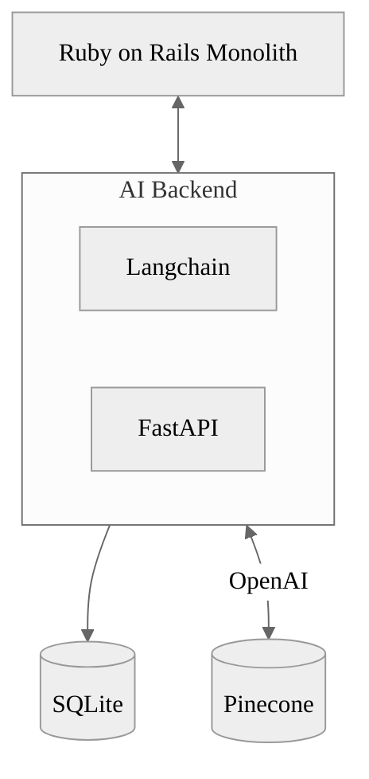
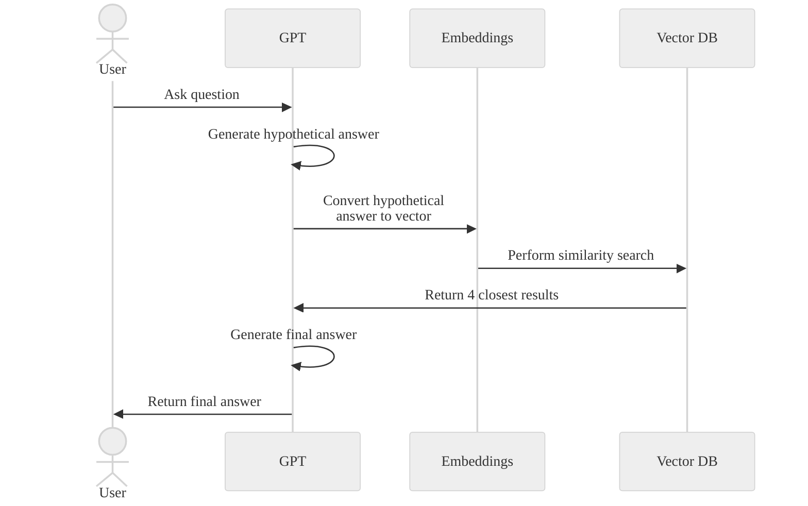

In 2023, the demands related to AI started arriving at the company where I work. Initially, the plan was to bring in someone to guide us, but I decided to take the lead and learn myself. Everything I had heard about AI suggested it was a complex field, so I was anticipating a significant challenge. However, it turned out to be much more manageable than I had expected.

In short, building an AI solution is as challenging as any other project. While it sounds impressive to say, “I’m working with AI,” it’s mostly about designing the solution, organizing the code well, and using some APIs.

The key takeaway is to keep things simple. As a developer, unless you’re aiming to innovate in AI, you don’t need to understand how the models work internally. You just need to know how to use them.

## The confusion of the first steps

When the AI challenge first arose, everything we knew pointed towards Python. After some research, I discovered the [Langchain framework](https://www.langchain.com/). This was a game-changer: a framework designed to simplify the complexities of AI. As someone who uses Ruby on Rails for its ease of use, I started to envision myself becoming proficient in Langchain.

In just three days, I went from zero to an MVP of a chatbot using 1,000 of our company’s articles. We had a breakthrough. The whole team began to see a path to a production-ready solution using our extensive library of over 100,000 articles.

I then devised an architecture that separated the AI components in Python and the UI in Ruby on Rails. That was our first mistake.

## A vector database is just a simple database

We needed a database to store the vectors of the articles. Like everything in AI, we assumed we needed something very specialized. We found Pinecone, a database service. It was great for building the MVP, but we soon realized the cost of storing the million vectors created from chunking the articles was too high.

We moved away from Pinecone and searched for self-hosted solution. We found [Chroma](https://www.trychroma.com/) and still use it today. However, we could have used a simple [PostgreSQL database with an extension](https://github.com/pgvector/pgvector), which is now my default choice for new projects. Alternatively, we could have stored the vectors in [Redis](https://redis.io/docs/latest/develop/get-started/vector-database/) or [ElasticSearch](https://www.elastic.co/elasticsearch/vector-database).

In the end, vectors are just simple arrays of numbers. You don't need a specialized database to store them.

## Exchange Langchain for your own algorithm

Langchain was a joy to use initially and remains very useful for text pre-processing. But when we began planning a production-ready solution, we realized we needed more control over the algorithm, and Langchain felt like a black box.

After some research, we adopted the [HyDE Generation](https://community.openai.com/t/hyde-based-semantic-search-enabled-on-the-openai-forum/361207)approach. The idea is to create a hypothetical answer (allowing the model to hallucinate freely), and then search for vectors close to this hypothetical answer. It's a simple concept, but it proved to be powerful and significantly improved the chatbot's results.

As soon as we realized that creating our own algorithm was the way to go, the Python backend became unnecessary. We moved everything to our Ruby on Rails monolith.

## AI as a feature, not a product

In the end, building an AI chatbot was just like adding any other feature. All the code was created the same way we would build a search engine or recommendation system. The data is stored in a regular database, just with a different structure. The heavy lifting of AI is handled by services like OpenAI and Anthropic.

With this realization, we started to think of AI as a feature, not a standalone product. We added AI to summarize articles, suggest questions to enhance chatbot use, and improve our search engine by showing answers related to our own articles. Everything was done in a simple and straightforward manner.

A year later, which is an eternity in AI development, we resisted the updates that caused startups to fail because we weren’t relying solely on simple prompts. We have our own data and our own algorithms. Of course, everything can become obsolete in a few months, but viewing AI as something that enhances our product, rather than being the product itself, makes it more resilient to changes.
